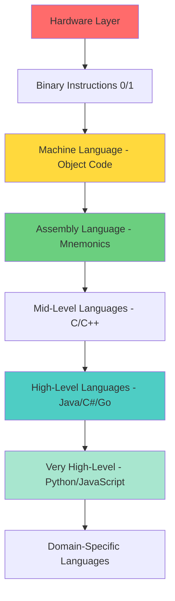

## What is a Programming Language?

A **programming language** is fundamentally a **tool** that enables developers to write **instructions** (called **CODE**) for computers to perform specific operations or tasks. High-level programming languages are build on Assembly Language, which is built on Machine Language.

Think of it as a bridge between human logic and machine execution - each language serves as a communication medium with different levels of abstraction from the hardware.

## The Language Hierarchy: From Hardware to Human

### 1. **Machine Language** (Lowest Level)
- **Definition**: Machine language uses binary and corresponds directly to hardware
- **Format**: Binary (0s and 1s) or Hexadecimal instructions
- **Also known as**: Object Code
- **Key characteristic**: The only language computers understand natively
- **Example**: `10110000 01100001` (moves value 97 into register AL in x86)

### 2. **Assembly Language** (Low Level)
- **Definition**: Assembly language is a higher-level representation of machine language that uses mnemonics and symbolic labels to make coding more human-readable
- **Format**: Uses mnemonics (memory aids) like MOV, ADD, SUB
- **Historical context**: Assemblers have been available since the 1950s, as the first step above machine language and before high-level programming languages such as Fortran, Algol, COBOL and Lisp
- **Example**: `MOV AL, 61h` (equivalent to the machine code above)

### 3. **High-Level Languages** (Most Abstract)
- **Definition**: High-level languages are programming languages that provide a greater level of abstraction from the hardware, making them easier for humans to read and write
- **Examples**: Python, JavaScript, Java, C++, C#, Go, Rust
- **Also known as**: Source Code
- **Key advantage**: Rather than dealing with registers, memory addresses, and call stacks, high-level languages provide abstraction

## Current Industry Landscape (2025)

### Most Popular Languages:
Python remains the undisputed leader, with a massive +8.72% increase in ratings due to its dominance in:
- Artificial Intelligence & Machine Learning
- Data Science & Analytics
- Automation & Scripting
- Web Development

### Top Languages by Category:
- **Most Admired**: Rust is yet again the most admired programming language (72%), followed by Gleam (70%), Elixir (66%) and Zig (64%)
- **Versatile Champions**: Python, JavaScript, and Java have always been among the top suggestions due to their versatility, as well as job market demand
- **Performance Leaders**: Other languages, like Go and Rust, gain a lot of prominence owing to their performance coupled with modern features

## The Translation Process

**Critical Concept**: A computer's native language is called Machine Language, so high-level languages require **Translation Software**.

### Translation Software Types:
1. **Compilers**: Translate entire programs before execution
2. **Interpreters**: Translate and execute code line by line
3. **Hybrid approaches**: Just-in-time compilation, transpilation

## Programming Language Levels Visualization

## Key Questions to Explore:

1. **Why do we need different levels of programming languages?**
   - Consider the trade-offs between human readability and machine efficiency

2. **How does the choice of programming language affect:**
   - Development speed?
   - Program performance?
   - Maintenance complexity?
   - Team collaboration?

3. **What makes Python so popular in 2025?**
   - Think about the relationship between simplicity and powerful libraries

4. **When might you choose a lower-level language over a high-level one?**
   - Consider scenarios where direct hardware control matters

---
