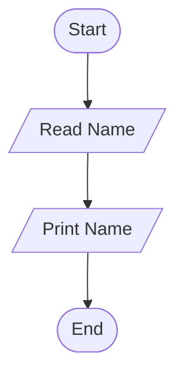

# Requirement : 

write a Flowchart program to : 

- "ask the user to enter her/his name and print it on the screen"

# Solution : 

```mermaid
flowchart TD
    A([Start]) --> B[/Read Name/]
    B --> C[/Print Name/]
    C --> D([End])
```
