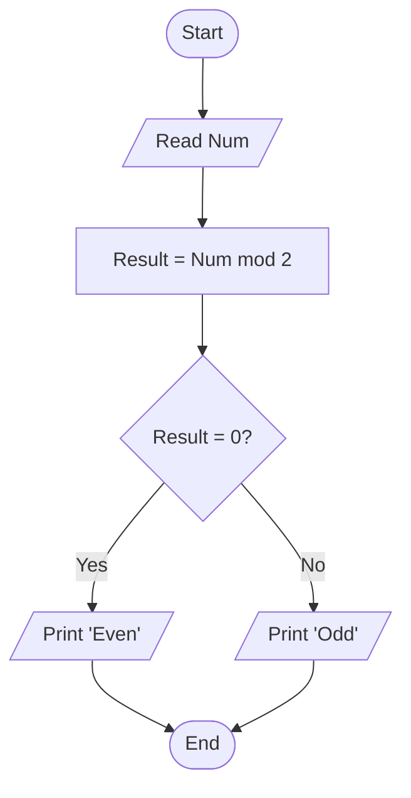

# Requirement : 

write a Flowchart program to : 

- "ask user to enter a number , then print "ODD" if it's odd, Or "Even" if it's even"

Note : 

  ODD = فردي 
  EVEN = زوجي

# Solution :  

```mermaid
flowchart TD
    Start(["Start"]) --> ReadNum[/"Read Num"/]
    ReadNum --> Calc["Result = Num mod 2"]
    Calc --> Decision{"Result = 0?"}
    Decision -->|Yes| Even[/"Print 'Even'"/]
    Decision -->|No| Odd[/"Print 'Odd'"/]
    Even --> End(["End"])
    Odd --> End(["End"])

```

---
