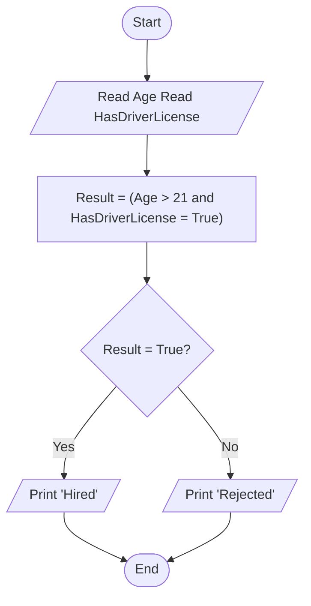

# Requirement : 

write a Flowchart program to : 

ask the user to enter his/her :

- Age
- Driver license

Then Print "Hired" if his/her age is grater than 21 **and** she/he has a driver license, otherwise Print "Rejected"

# Solution : 

