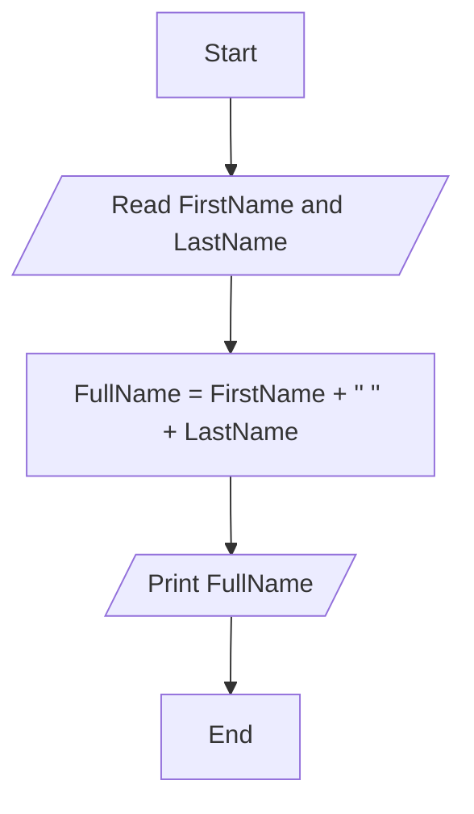

# Requirement : 

write a Flowchart program to : 

ask user to enter his 

- First Name
- Last Name

then print the full name on screen

# Solution :  

```mermaid

graph TD

    A[Start] --> B[/Read FirstName and LastName/]

    B --> C[FullName = FirstName + '' '' + LastName]

    C --> D[/Print FullName/]

    D --> E[End]
```
