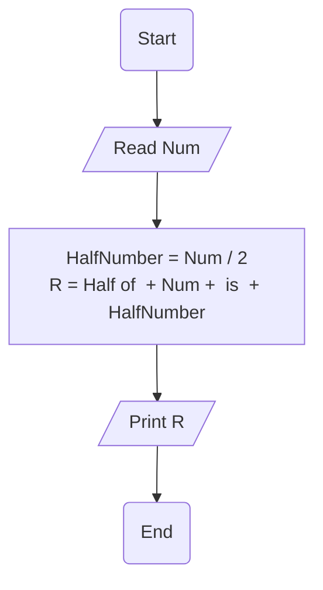

# Requirement : 

write a Flowchart program to : 

ask user to enter his 
  - Number

then print the Half of Number on screen. 

# Solution :  

```mermaid
graph TD

    A(Start) --> B[/Read Num/]

    B --> C[HalfNumber = Num / 2<br>R = Half of  + Num +  is  + HalfNumber]

    C --> D[/Print R/]

    D --> E(End)
```
