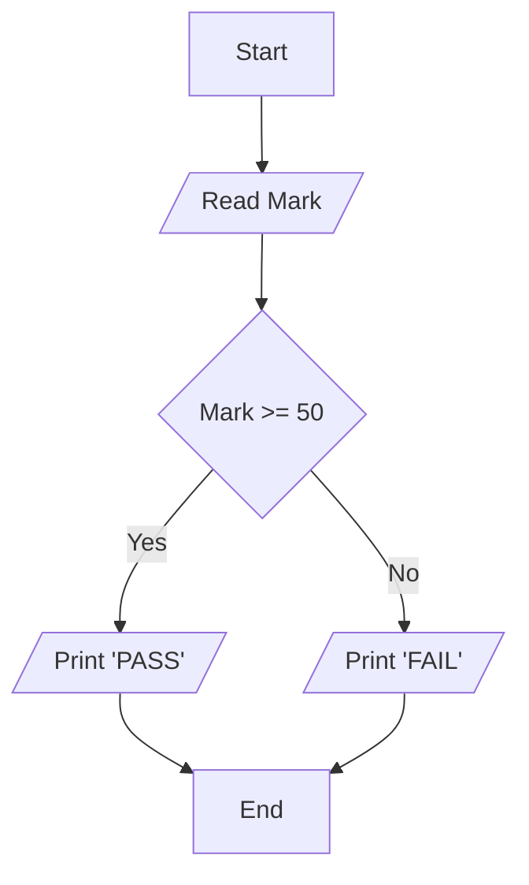

# Requirement : 

write a Flowchart program to : 

ask user to enter 

- Mark

then print "PASS" if Mark >=50 Otherwise print "Fail".

# Solution :

```mermaid
graph TD

    A[Start] --> B[/Read Mark/]

    B --> C{ Mark >= 50  }

    C -->|Yes| D[/Print 'PASS'/]

    C -->|No| E[/Print 'FAIL'/]

    D --> F[End]

    E --> F[End]
```
