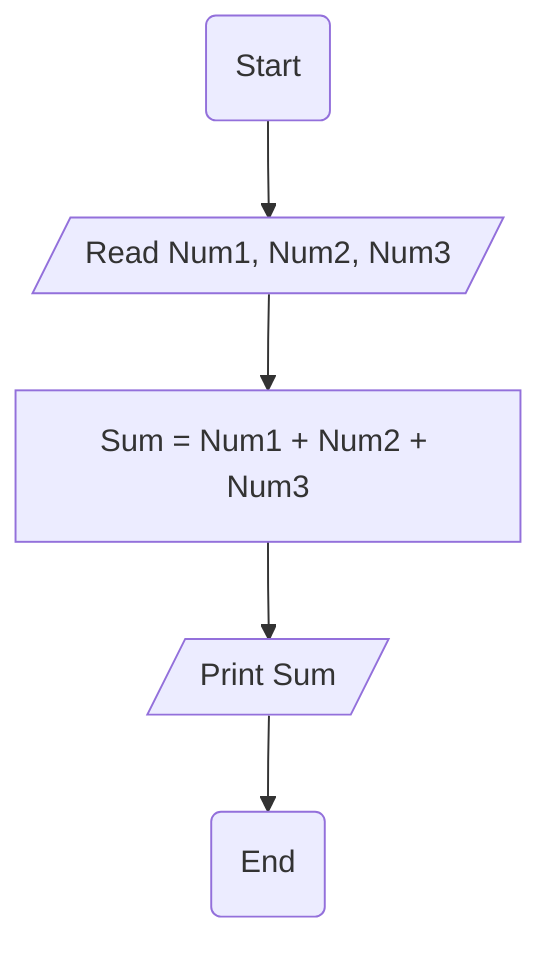

# Requirement : 

write a Flowchart program to : 

ask user to enter 

- Number 1 
- Number 2
- Number 3

then print the SUM of the entered numbers.

# Solution : 

```mermaid
graph TD

    A(Start) --> B[/Read Num1, Num2, Num3/]

    B --> C[Sum = Num1 + Num2 + Num3]

    C --> D[/Print Sum/]

    D --> E(End)
```

