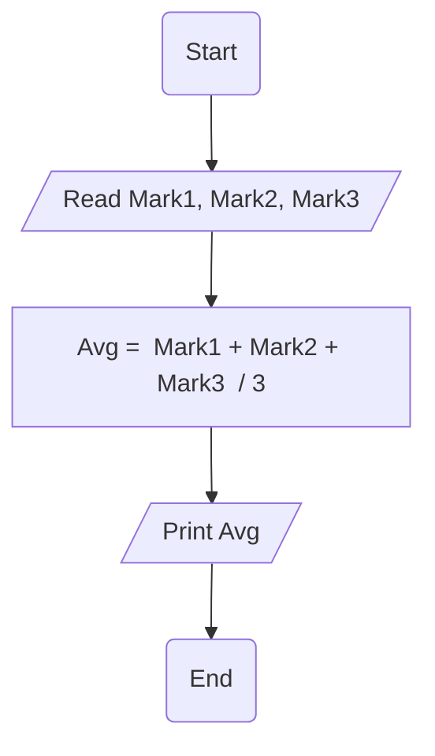

# Requirement : 

write a Flowchart program to : 

ask user to enter 

- Mark 1 
- Mark 2
- Mark 3 

then print the Average of entered Marks.

# Solution : 

```mermaid
graph TD

    A(Start) --> B[/Read Mark1, Mark2, Mark3/]

    B --> C[Avg =  Mark1 + Mark2 + Mark3  / 3]

    C --> D[/Print Avg/]

    D --> E(End)
```

