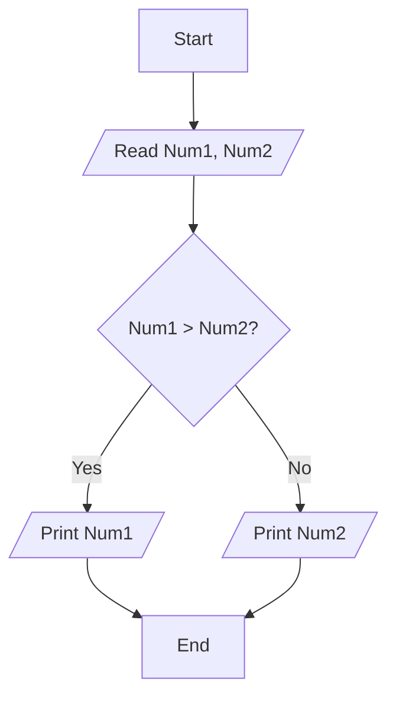

# Requirement : 

write a Flowchart program to : 

ask user to enter 

- Number 1 
- Number 2 

then print the Max Number.

# Solution : 

```mermaid
graph TD

    A[Start] --> B[/Read Num1, Num2/]

    B --> C{Num1 > Num2?}

    C -->|Yes| D[/Print Num1/]

    C -->|No| E[/Print Num2/]

    D --> F[End]

    E --> F[End]
```

