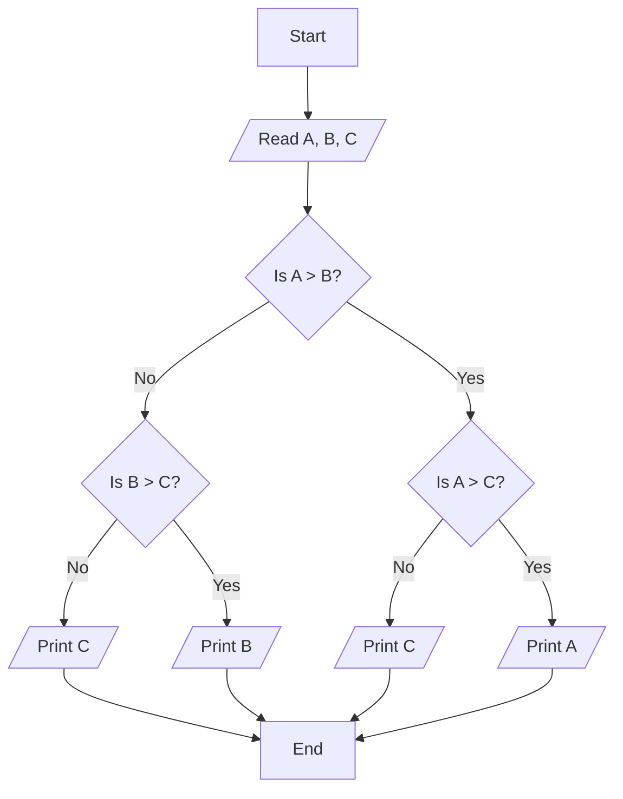

# Requiremenet : 

write a Flowchart program to : 

ask user to enter 3 numbers

- A
- B
- C

then print the Max number.

# Solution : 

```mermaid 
graph TD

    A[Start] --> B[/Read A, B, C/]

    B --> C{Is A > B?}

    C -->|No| D{Is B > C?}

    D -->|No| E[/Print C/]

    D -->|Yes| F[/Print B/]

    C -->|Yes| G{Is A > C?}

    G -->|No| H[/Print C/]

    G -->|Yes| I[/Print A/]

    E --> J[End]

    F --> J[End]

    H --> J[End]

    I --> J[End]
```
