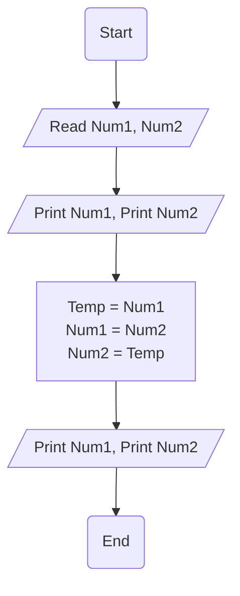

# Requirement : 

write a Flowchart program to : 

ask user to enter 

- Number 1 
- Number 2

then Print the <mark style="background: #FFB86CA6;">Two number</mark> then <mark style="background: #ABF7F7A6;">swap the numbers</mark> and print them.

# Solution : 

