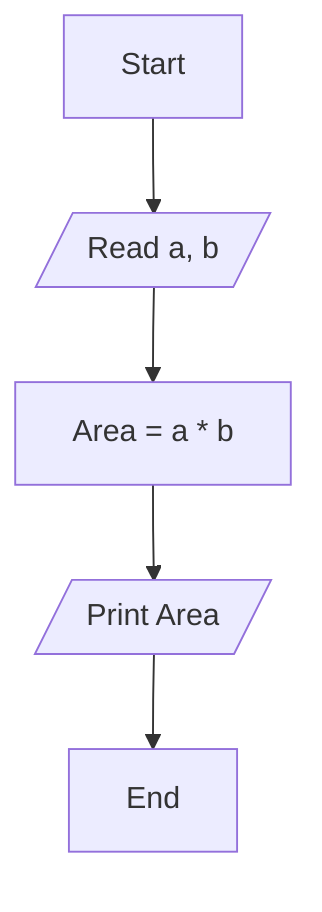

# Requirement : 

write a Flowchart program to : 

 calculate rectangle area and print it on the screen.

$$
Area = a . b
$$

- Area = a . b 

# Solution : 

```mermaid
graph TD

    A[Start] --> B[/Read a, b/]

    B --> C[Area = a * b]

    C --> D[/Print Area/]

    D --> E[End]
```
