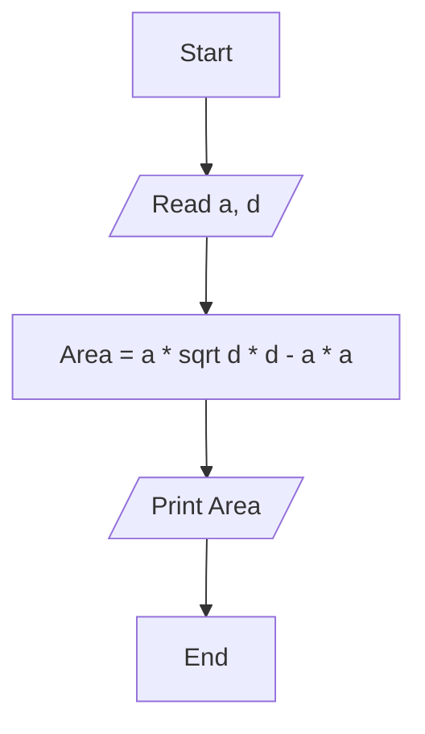

# Requirement : 

write a Flowchart program to : 

calculate rectangle area through  diagonal and side area of rectangle and print it on the screen.

$$

{Area} = a \cdot \sqrt{d^2 - a^2} 

$$

 - Area = a * sqrt (d * 2 - (a * 2) )

# Solution : 

