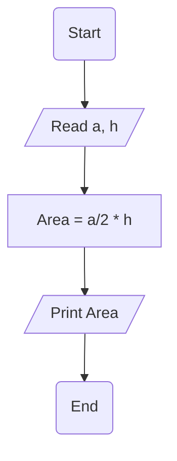

# Requirement : 

write a Flowchart program to : 

calculate triangle area then print it on the screen.

$$

{Area} = \frac{1}{2} a . h 

$$
the user should enter 
- `a`
- `h`

# Solution : 

```mermaid
graph TD

    A(Start) --> B[/Read a, h/]

    B --> C[Area = a/2 * h]

    C --> D[/Print Area/]

    D --> E(End)
```
