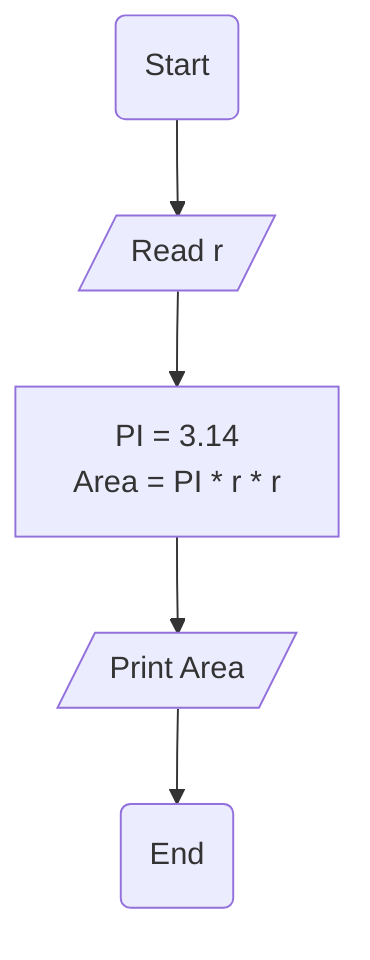

# Requirement : 

write a Flowchart program to : 

calculate circle area then print it on the screen.

$$

{Area} = \pi \cdot r^2 

$$
the user should enter 
- r 

Area = PI * (r * r )

# Solution :  

