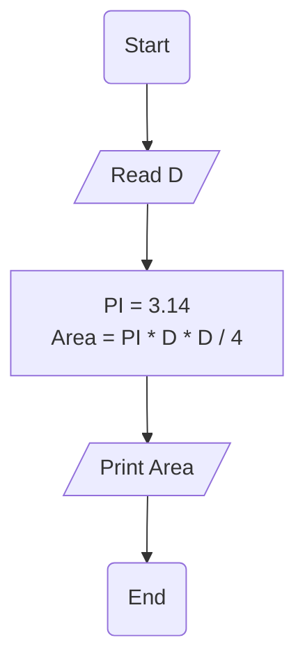

# Requiremenet : 

write a Flowchart program to : 

calculate circle area through diameter then print it on the screen.

$$

{Area} = \frac{\pi \cdot D ^2}{4} 

$$

the user should enter 
- D 

Area = (PI * D * D) / 4 

# Solution :  

