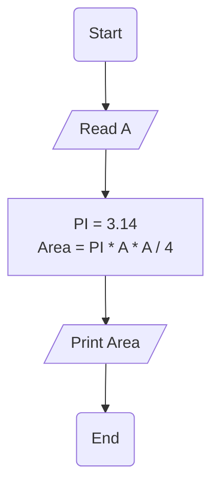

# Requirement : 

write a Flowchart program to : 

calculate circle area inscribed in a square then print it on the screen.

$$

{Area} = \frac{\pi \cdot A  ^2}{4} 

$$

the user should enter 
- A 

Area =(PI * A * A) / 4 

# Solution : 

