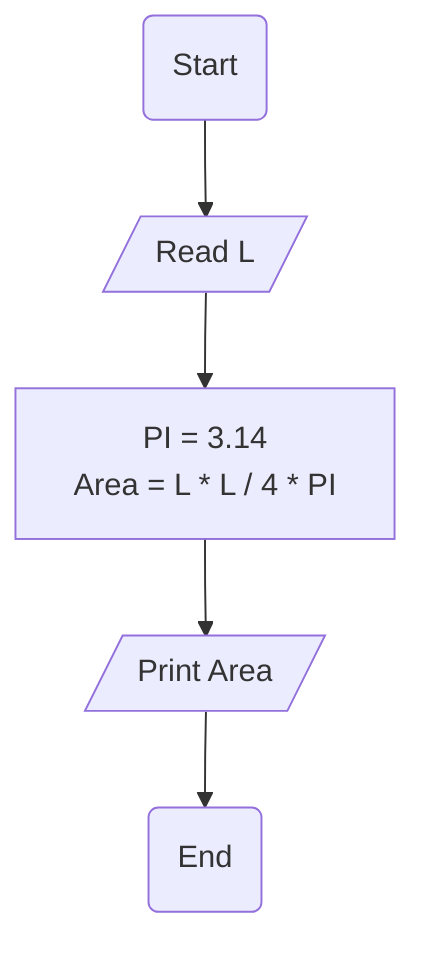

# Requirement : 

write a Flowchart program to : 

calculate circle area along the circumference  then print it on the screen.

$$

{Area} = \frac{L ^2}{4  .  \pi} 

$$

the user should enter 
- L

Area = (L * L) / (4 * PI) 

# Solution : 

