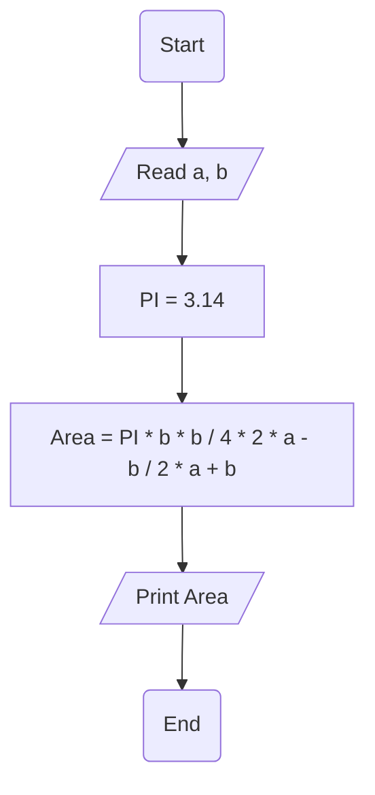

# Requiremenet : 

write a Flowchart program to : 

calculate circle area Inscribed in an Isosceles Triangle   then print it on the screen.

$$

{Area} =  \pi\frac{   b  ^2}{4}\cdot \left( \frac{2 . a - b}{2 . a + b} \right) 

$$

the user should enter 
- a
- b 

Area = (PI * b * b / 4) * (2 * a - b ) / (2 * a + b ) 

# Solution : 

