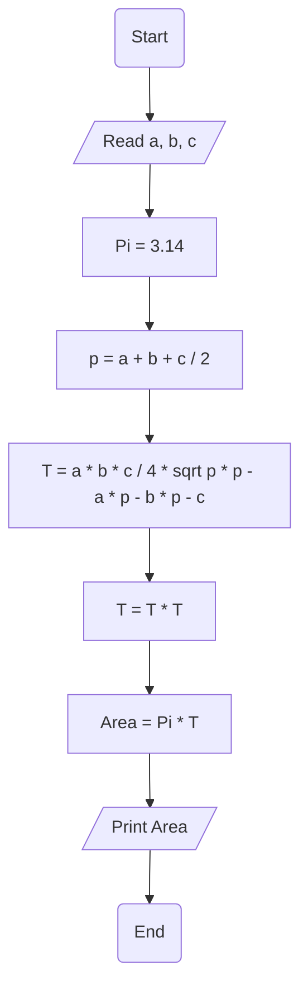

# Requirement : 

write a Flowchart program to : 

calculate circle area described around an arbitrary tringle  then print it on the screen.

$$
p = \frac{a + b + c}{2} \
$$
$$

 Area= \pi .(\frac{a \cdot b \cdot c}{4 \cdot \sqrt{p \cdot (p - a) \cdot (p - b) \cdot (p - c)}} )^2

$$

the user should enter 
- a
- b
- c 

p = (a + b + c) / 2 
T = (a * b * c) / ( 4 * sqrt ( p * (p - a) * (p - b) * (p - c))

# Solution : 

