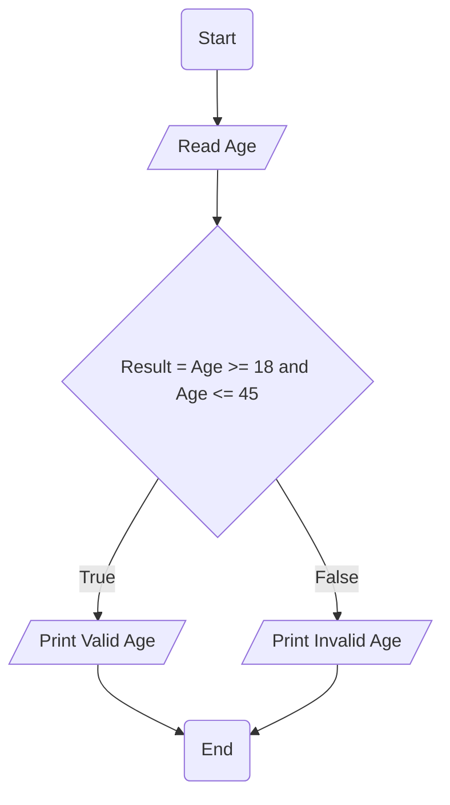

# Requirement : 

write a Flowchart program to : 

ask the user to enter :

- Age

If age is <mark style="background: #FF5582A6;">between 18 and 45</mark> print " Valid Age " otherwise print " Invalid Age " 

 - (Age >= 18 and Age <= 45) 

# Solution : 

