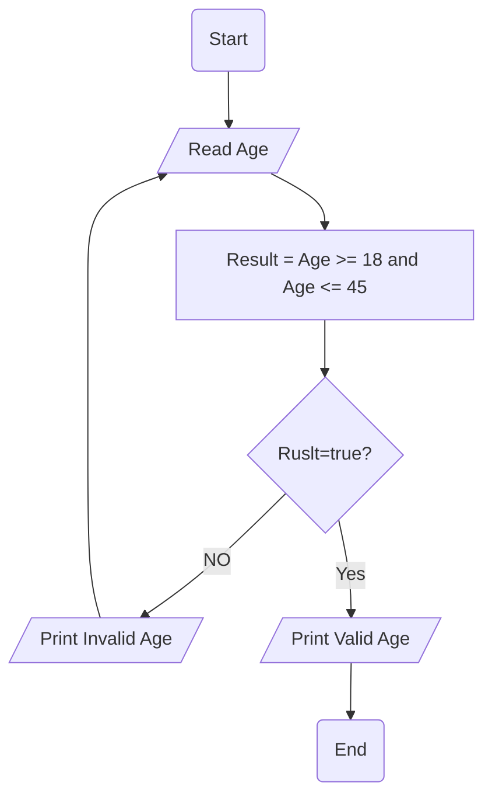

# Requiremenet : 

write a Flowchart program to : 

ask the user to enter :

- Age 

If age is between 18 and 45 print " Valid Age " otherwise print " Invalid Age " and re-ask user to enter a Valid age 

Note : you should keep asking user to enter a Valid age until h/s enters it.

- (Age >= 18 and Age <= 45) 

# Solution : 

