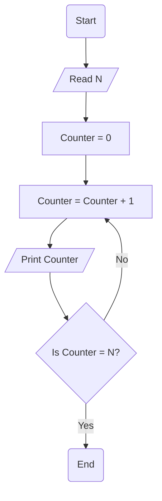

# Requirement : 

write a Flowchart program to : 

-  Numbers from 1 to N. 

# Solution : 

```mermaid
graph TD

    A(Start) --> B[/Read N/]

    B --> C[Counter = 0]

    C --> D[Counter = Counter + 1]

    D --> E[/Print Counter/]

    E --> F{Is Counter = N?}

    F -->|No| D

    F -->|Yes| G(End)
```
