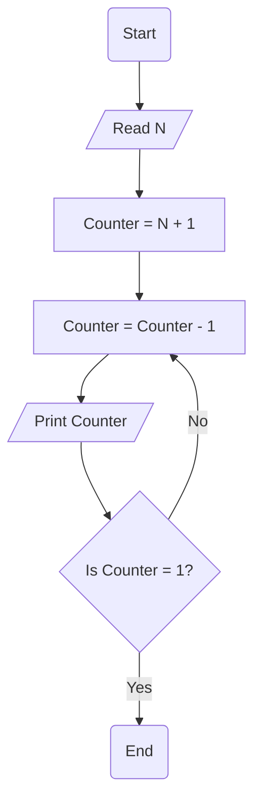

# Requirement : 

write a Flowchart program to : 

-  print numbers from N to 1.

# Solution : 

```mermaid
graph TD

    A(Start) --> B[/Read N/]

    B --> C[Counter = N + 1]

    C --> D[Counter = Counter - 1]

    D --> E[/Print Counter/]

   E --> F{Is Counter = 1?}

    F--> |Yes| G(End)  

    F--> |No| D
```
