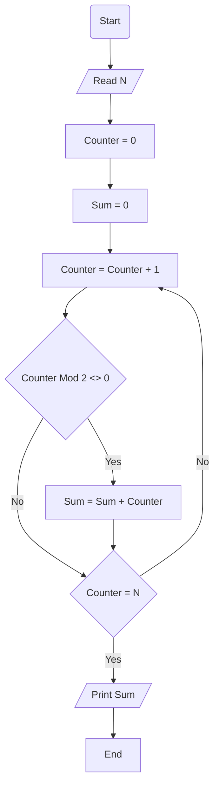

# Requirement : 

write a Flowchart program to : 

- Sum odd numbers from 1 to N.

# Solution : 

```mermaid

graph TD

    A(Start) --> B[/Read N/]

    B --> C[Counter = 0]

    C --> D[Sum = 0]

    D --> E[Counter = Counter + 1]

    E --> F{Counter Mod 2 <> 0}

    F -->|Yes| G[Sum = Sum + Counter]

    F -->|No| H{Counter = N}

    G --> H

    H -->|Yes| I[/Print Sum/]

    H -->|No| E

    I --> J[End]
```

