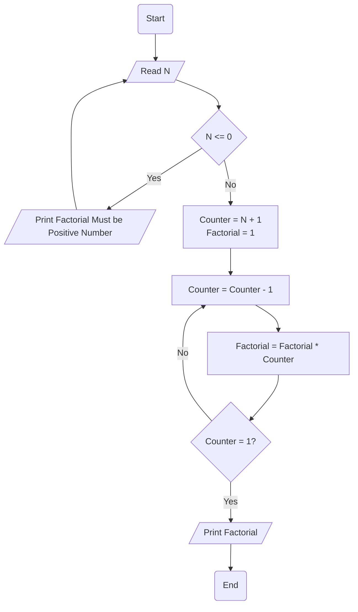

# Requirement : 

write a Flowchart program to : 

-  calculate factorial of N! 

# Solution : 

```mermaid
graph TD

    A(Start) --> B[/Read N/]

    B --> C{N <= 0}

    C -->|Yes| D[/Print Factorial Must be Positive Number/]

    D -->B

    C -->|No| E[Counter = N + 1<br>Factorial = 1]

    E --> F[Counter = Counter - 1]

    F --> G[Factorial = Factorial * Counter]

    G --> H{Counter = 1?}

    H -->|No| F

    H -->|Yes| I[/Print Factorial/]

    I --> J(End)
```
