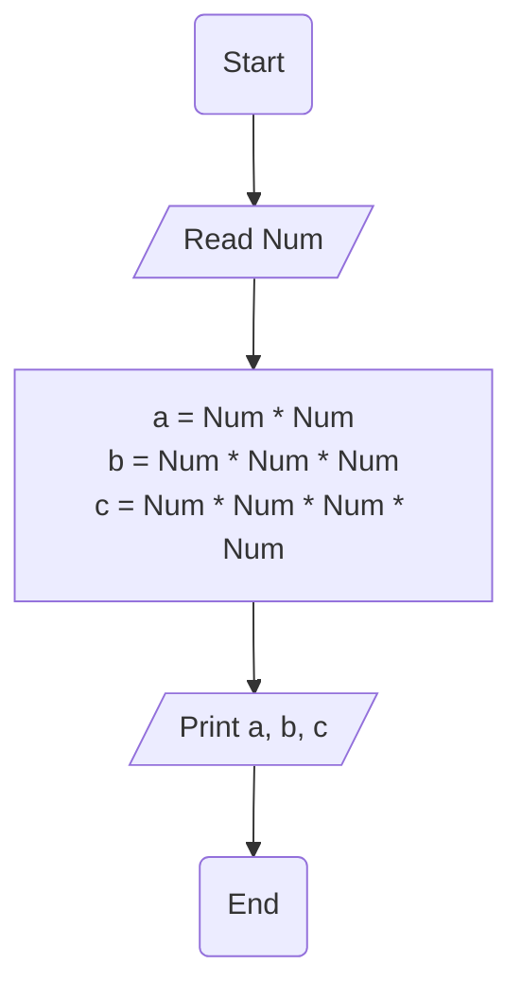

# Requirement : 

write a Flowchart program to : 

ask the user to enter :

- Number

then Print the Number^2 , Number^3 , Number^4 .

# Solution : 

```mermaid
graph TD

    A(Start) --> B[/Read Num/]

    B --> C[a = Num * Num<br>b = Num * Num * Num<br>c = Num * Num * Num * Num]

    C --> D[/Print a, b, c/]

    D --> E(End)
```
