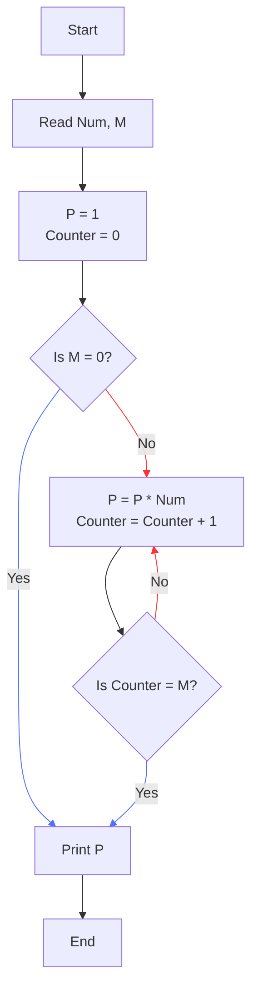

# Requirement : 

write a Flowchart program to : 

ask the user to enter :

- Number
- M

Then Print the Number^M 

# Solution : 

```mermaid
graph TD

    A[Start] --> B[Read Num, M]

    B --> C[P = 1<br>Counter = 0]

    C --> D{Is M = 0?}

    D -->|Yes| E[Print P]

    D -->|No| F[P = P * Num<br>Counter = Counter + 1]

    F --> G{Is Counter = M?}

    G -->|Yes| E

    G -->|No| F

    E --> K[End]

    linkStyle 3 stroke:#5271FF

    linkStyle 4 stroke:#FF3131

    linkStyle 7 stroke:#FF3131

    linkStyle 6 stroke:#5271FF
```
