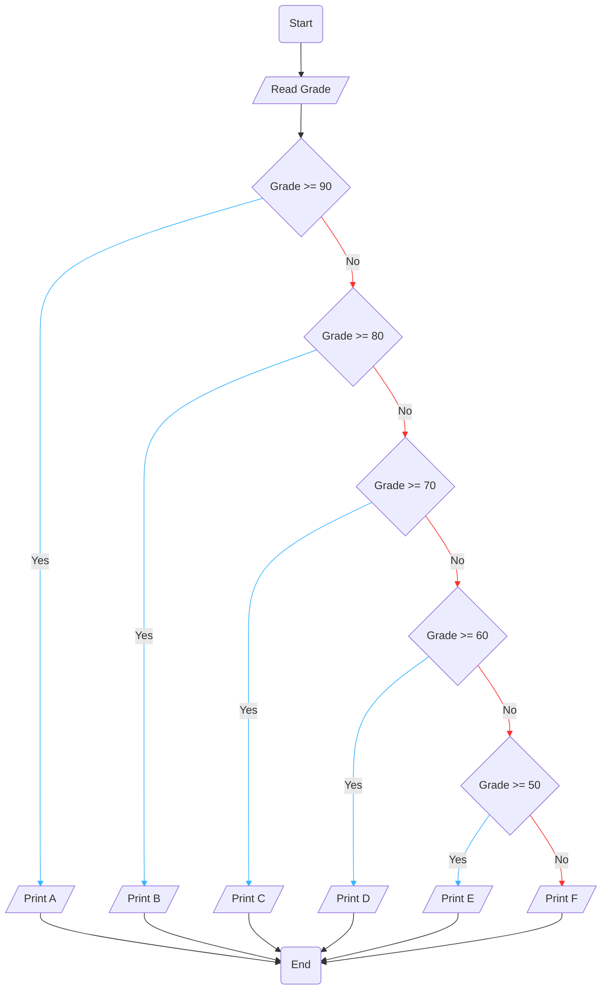

# Requirement : 

write a Flowchart program to : 

ask the user to enter :

- Grade

Then Print the grade as follows :

- 90 - 100 Print A 
- 80 - 89 Print B 
- 70 - 79 Print C 
- 60 - 69 Print D 
- 50 -59 Print E
- otherwise Print F 

# Solution : 

