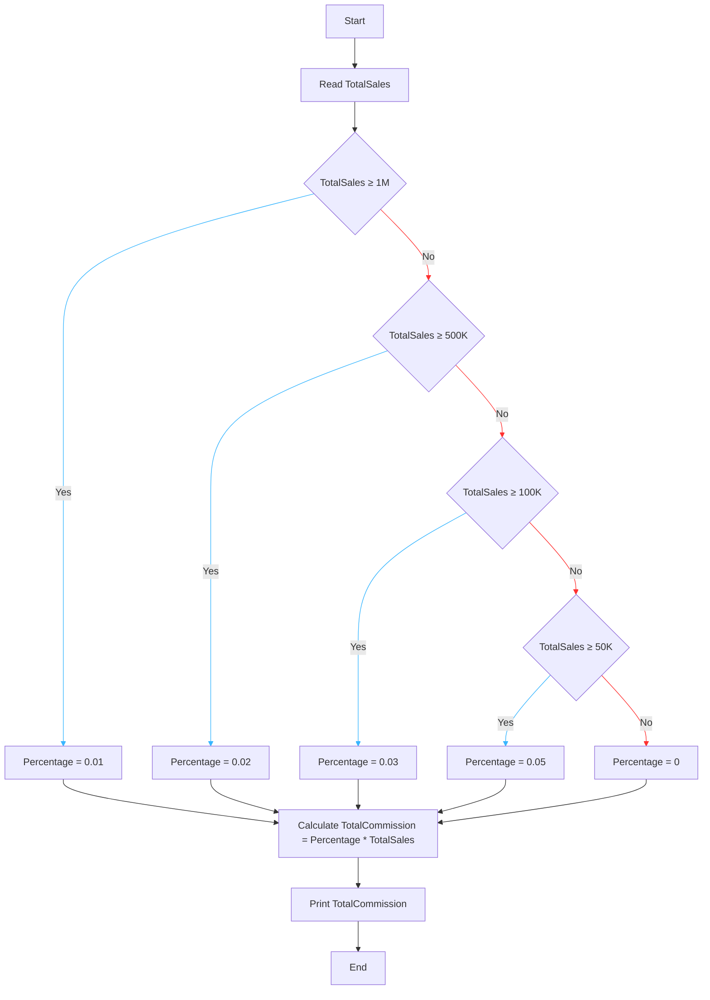

# Requirement : 

write a Flowchart program to : 

ask the user to enter :

- TotalSales

The commission is calculated as <mark style="background: #FF5582A6;">one percentage * the total sales amount</mark> , all you need is to decide which percentage to use of the following :

- >1000,000 :  Percentage is 1%
- >500k to 1M  :  Percentage is 2%
- >100k - 500k :  Percentage is 3%
- >50k to 100k :  Percentage is 5%
- otherwise : Percentage is 0% 

# Solution :  

