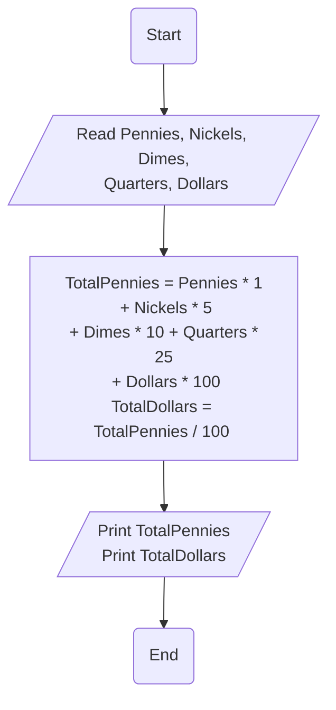

# Requirement : 

write a Flowchart program to : 

ask user to enter : 

- Pennies, Nickels, Dimes, Quarters, Dollars

Then calculate the<mark style="background: #FF5582A6;"> total pennies</mark> , <mark style="background: #FF5582A6;">total dollars</mark> and print them on screen giving that :

- Penny = 1 
- Nickle = 5
- Dime = 10
- Quarter =25
- Dollar = 100

# Solution : 

