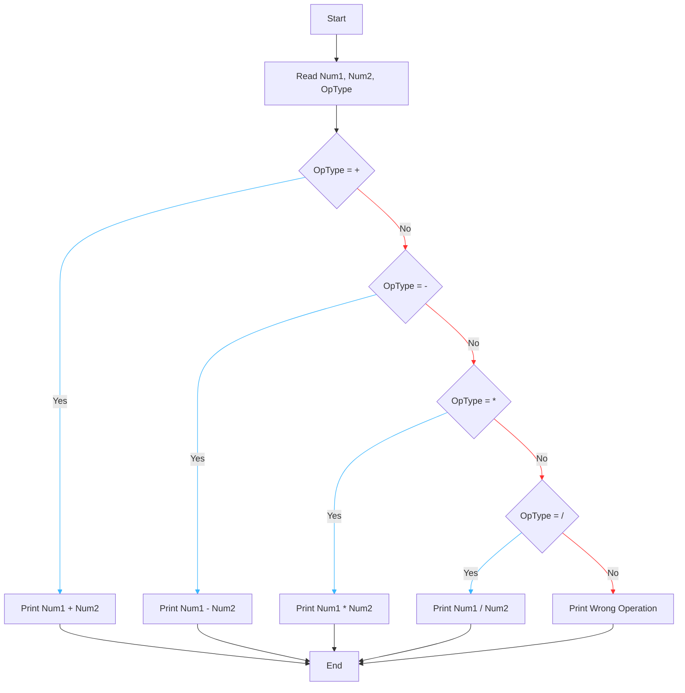

# Requirement : 

write a Flowchart program to : 

ask the user to enter :

- Number 1 
- Number 2
- Operation type 

then perform the calculation according to the Operation type as following :

- " + " : add the two numbers.
- " - "  : Subtract the two numbers.
- " * " : Multiply the two numbers.
- " / " : Divide the two numbers. 

# Solution : 

