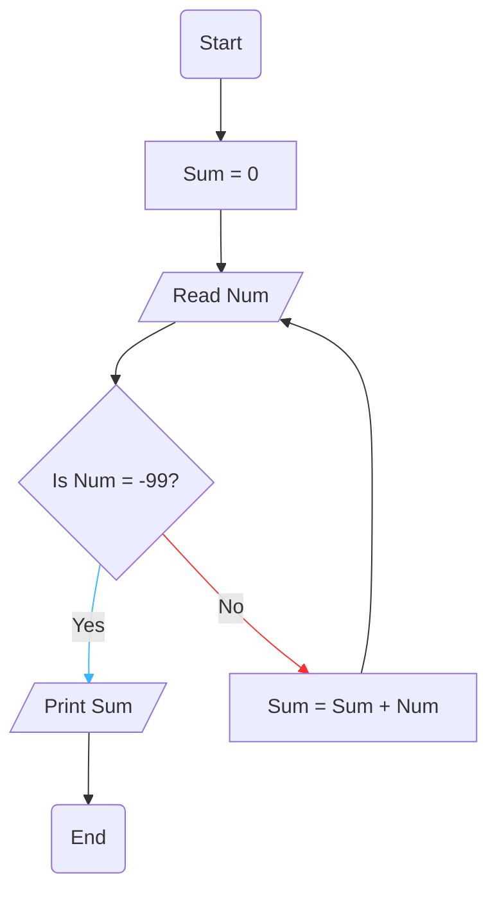

# Requirement : 

write a Flowchart program to : 

read numbers from user and sum them , keep reading until the user enters -99 then  print the sum on screen.

# Solution :  

```mermaid
graph TD

    A(Start) --> B[Sum = 0]

    B --> C[/Read Num/]

    C --> D{Is Num = -99?}

    D -->|Yes| E[/Print Sum/]

    D -->|No| F[Sum = Sum + Num]

    F --> C

    E -->G(End)

    linkStyle 3 stroke:#38B6FF

    linkStyle 4 stroke:#FF3131
```
