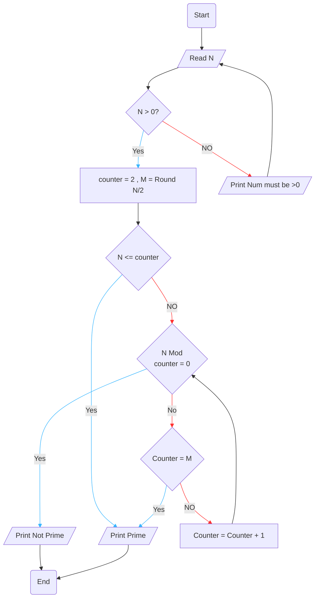

# Requirement : 

write a Flowchart program to : 

read a number and check if it is a prime number or not .

<mark style="background: #FFF3A3A6;">Note </mark>: Prime number can only divide on one and on itself.

# Solution :

