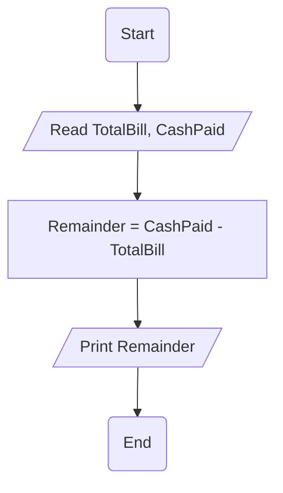

# Requirement : 

write a Flowchart program to : 

- read a Total Bill and Cash Paid and calculate the remainder to be paid back

# Solution : 

```mermaid
graph TD

    A(Start) --> B[/Read TotalBill, CashPaid/]

    B --> C[Remainder = CashPaid - TotalBill]

    C --> D[/Print Remainder/]

    D --> E(End)
```
