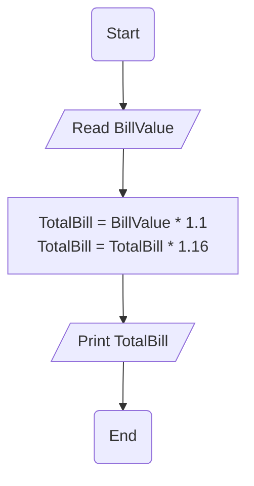

# Requirement : 

write a Flowchart program to : 

- A restaurant charges 10% services fee and 16% sales tax.
- read a Bill Value and add service fee and sales tax to it, and print the Total Bill on the screen.

# Solution : 

