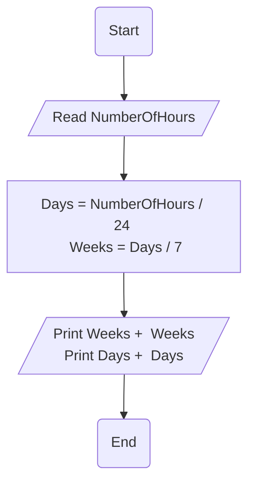

# Requirement : 

write a Flowchart program to : 

 - read a Number Of Hours and calculates the number of weeks, and days included in that number.

# Solution : 

```mermaid
graph TD

    A(Start) --> B[/Read NumberOfHours/]

    B --> C[Days = NumberOfHours / 24 <br> Weeks = Days / 7]

    C --> D[/Print Weeks +  Weeks <br> Print Days +  Days/]

    D --> G(End)
```
