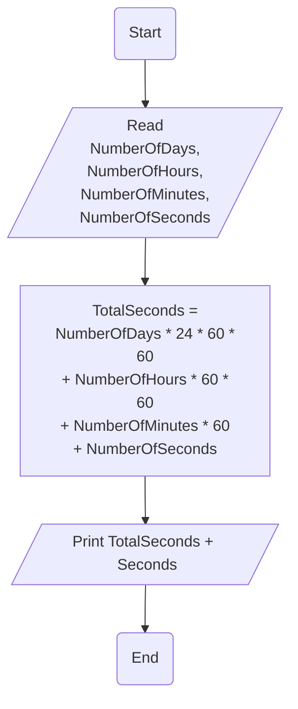

# Requirement : 

write a Flowchart program to : 

calculate the task duration in seconds and print it on screen 

→ Giving the time duration of a task in the number of days, hours, minutes, and second. 

# Solution : 

