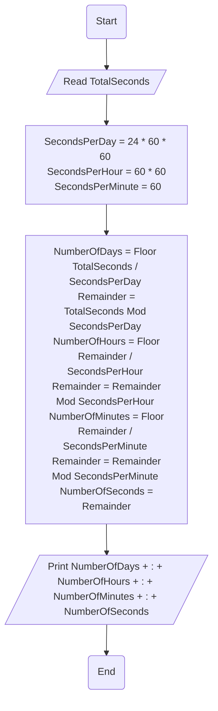

# Requirement : 

write a Flowchart program to : 

- input the number of seconds and changes it to days, hours, minutes, and seconds.

# Solution : 

```mermaid
graph TD

    A(Start) --> B[/Read TotalSeconds/]

    B --> C[SecondsPerDay = 24 * 60 * 60 <br> SecondsPerHour = 60 * 60 <br> SecondsPerMinute = 60 ]                                                                                                                                    

    C --> D[NumberOfDays = Floor TotalSeconds / SecondsPerDay <br> Remainder = TotalSeconds Mod SecondsPerDay <br> NumberOfHours = Floor Remainder / SecondsPerHour <br> Remainder = Remainder Mod SecondsPerHour <br> NumberOfMinutes = Floor Remainder / SecondsPerMinute <br> Remainder = Remainder Mod SecondsPerMinute <br> NumberOfSeconds = Remainder ]

    D --> E[/Print NumberOfDays + : + NumberOfHours + : + NumberOfMinutes + : + NumberOfSeconds/]

    E --> N(End)
```
