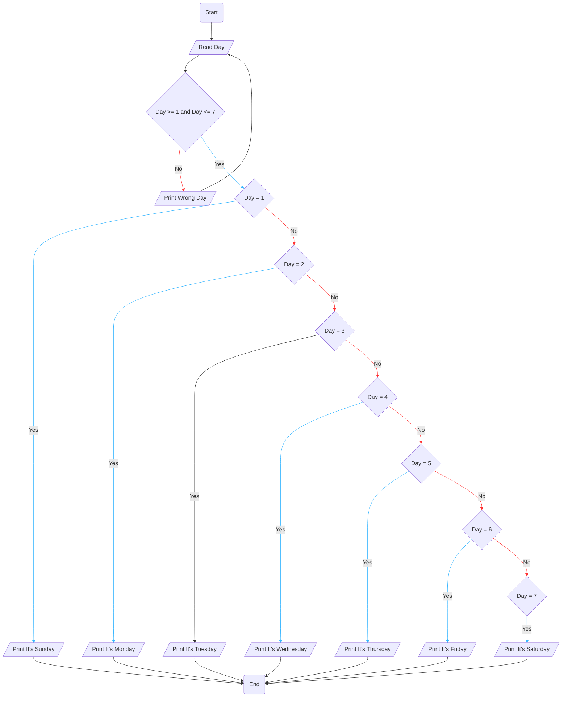

# Requirement : 

write a Flowchart program to : 

ask the user to enter :

- Day 

then print the day as follows :

- 1 print Sunday
- 2 print Monday
- 3 print Tuesday
- 4 print Wednesday 
- 5 print Thursday
- 6 print Friday
- 7 print Sunday
- otherwise print " Wrong Day " and ask the user to enter the day again.

# Solution : 

