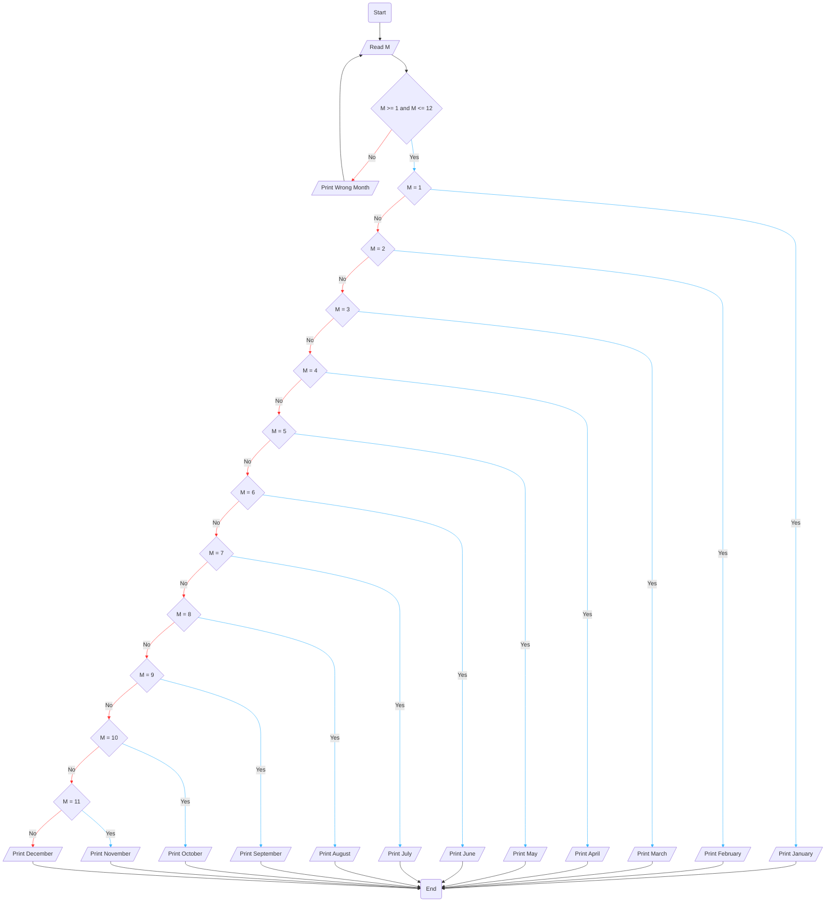

# Requirement : 

write a Flowchart program to : 

 ask the user to enter :

- Month

Then print the Month as follows :

- 1 print January 
- 2 print February 
- 3 print March
- 4 print April 
- 5 print May
- 6 print June
- 7 print July 
- 8 print August
- 9 print September 
- 10 print October
- 11 print November
- 12 print December 
- Otherwise print " Wrong Month " and ask the user to enter the Month again. 

# Solution :

