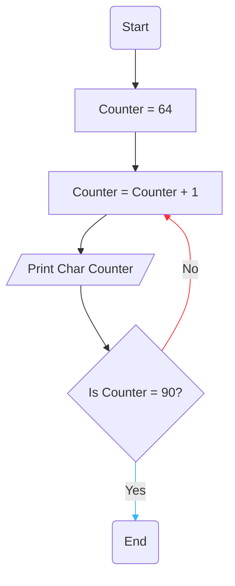

# Requirement : 

write a Flowchart program to : 

- print all letters from A to Z. 

# Solution : 

```mermaid
graph TD

    A(Start) --> B[Counter = 64]

    B --> C[Counter = Counter + 1]

    C --> D[/Print Char Counter/]

    D --> E{Is Counter = 90?}

    E -->|No| C

    E -->|Yes| F(End)

  

    linkStyle 5 stroke:#38B6FF

    linkStyle 4 stroke:#FF3131


```
