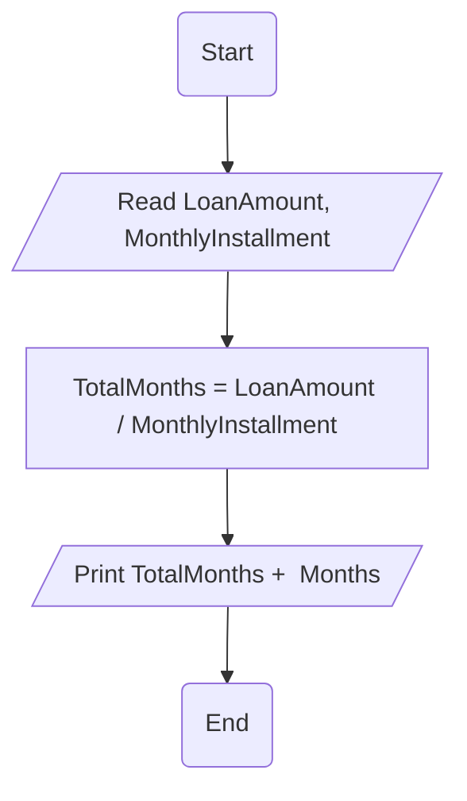

# Requirement : 

write a Flowchart program to : 

- read a LoanAmount and Monthly Payment and calculate how many months you need to settle the loan.

# Solution : 

```mermaid
graph TD

    A(Start) --> B[/Read LoanAmount, MonthlyInstallment  /]

    B --> C[TotalMonths = LoanAmount / MonthlyInstallment  ]

    C --> D[/Print TotalMonths +  Months  /]

    D --> E(End)
```
