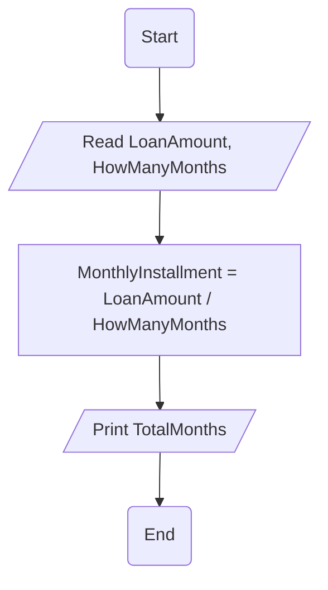

# Requirement : 

write a Flowchart program to : 

- read a Loan Amount and ask you how many months you need to settle the loan , then calculate the monthly instalment amount.

# Solution :

```mermaid
graph TD

    A(Start) --> B[/Read LoanAmount, HowManyMonths/]

    B --> C[MonthlyInstallment = LoanAmount / HowManyMonths]

    C --> D[/Print TotalMonths/]

    D --> E(End)

```
