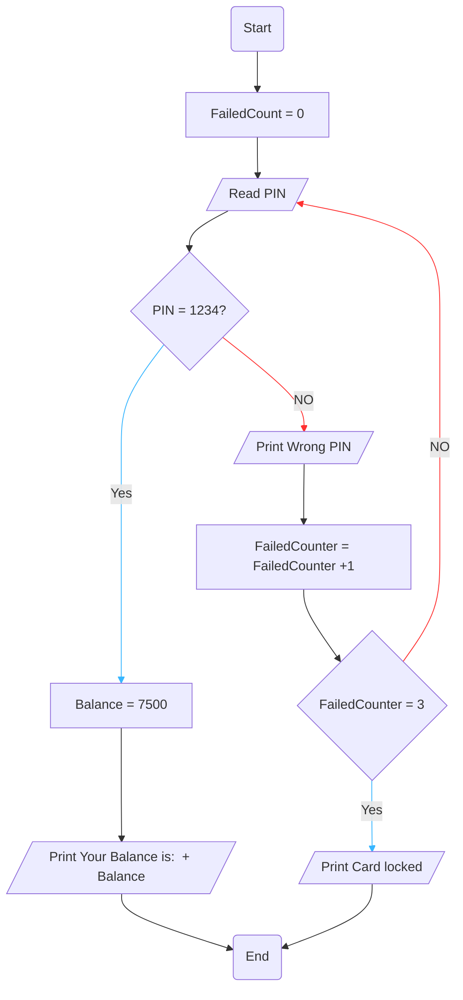

# Requirement : 

write a Flowchart program to : 

- read the ATM PIN code from the user , then check if PIN code = 1234,  then show the balance to user , otherwise print " Wrong PIN " and ask the user to enter the PIN again .

Only allow user to enter the PIN 3 times , if fails , print " Card is locked! "

# Solution : 

