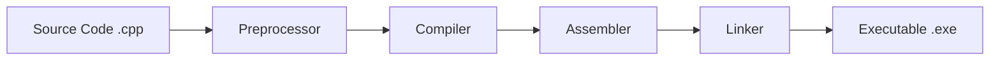

#### **C ++ syntax** 
is the **grammatical structure** that defines how C++ programs are written and organized. Think of it as the <span style="color:rgb(20, 192, 255)"><b>blueprint</b></span> for building functional software - just like architectural blueprints guide construction, C++ syntax guides code creation.

##  The Anatomy of C++ Syntax

```c++
#include <iostream>

int main()
{
    std::cout << "Ualid Ahlidou";
    return 0;
}
```

###  Deep Dive - Every Component Explained

#### 1. `#include <iostream>` - The Doorway to Input / Output
- **What it is**: A **preprocessor directive** that imports the Input / Output Stream library
- **Why it matters**: Without this, your program cannot communicate with the outside world
- **Real-world analogy**: Like installing a telephone line in your house to communicate with others
- **Memory impact**: Adds ~300KB to your executable but provides essential functionality

#### 2. `int main()` - The Command Center
- **Definition**: The **entry point** of every C++ program - where execution begins
- **Return type**: `int` means it returns an integer status code to the operating system
  - `0` = Success, program executed without errors
  - Non-zero = Error occurred during execution
- **Why it's special**: The operating system looks specifically for this function to start your program

#### 3. `{}` - The Execution Boundary
- **Purpose**: Define the **scope** and boundaries of code blocks
- **Rule**: Every opening `{` must have a matching closing `}`

#### 4. `std::cout` - The Communication Channel
- **Full name**: Standard Character Output Stream
- **Breaking it down**:
  - `std` = **namespace** (like a family name for related functions)
  - `::` = **scope resolution operator** (connects namespace to object)
  - `cout` = **console output object**

#### 5. `<<` - The Stream Insertion Operator
- **Visualization**: Think of it as a **funnel** that pours data into the output stream
- **Direction**: Data flows from right to left: `Data → << → cout → Screen`
- **Chaining**: You can use multiple `<<` operators: `cout << "Hello" << " " << "World";`

#### 6. `return 0;` - The Success Signal
- **Purpose**: Tells the operating system the program completed successfully
- **Convention**: 0 = success, any other number indicates an error condition
- **Mandatory**: Every `int main()` function must return a value

## 🧠 Memory and Compilation Process



