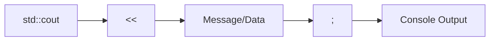
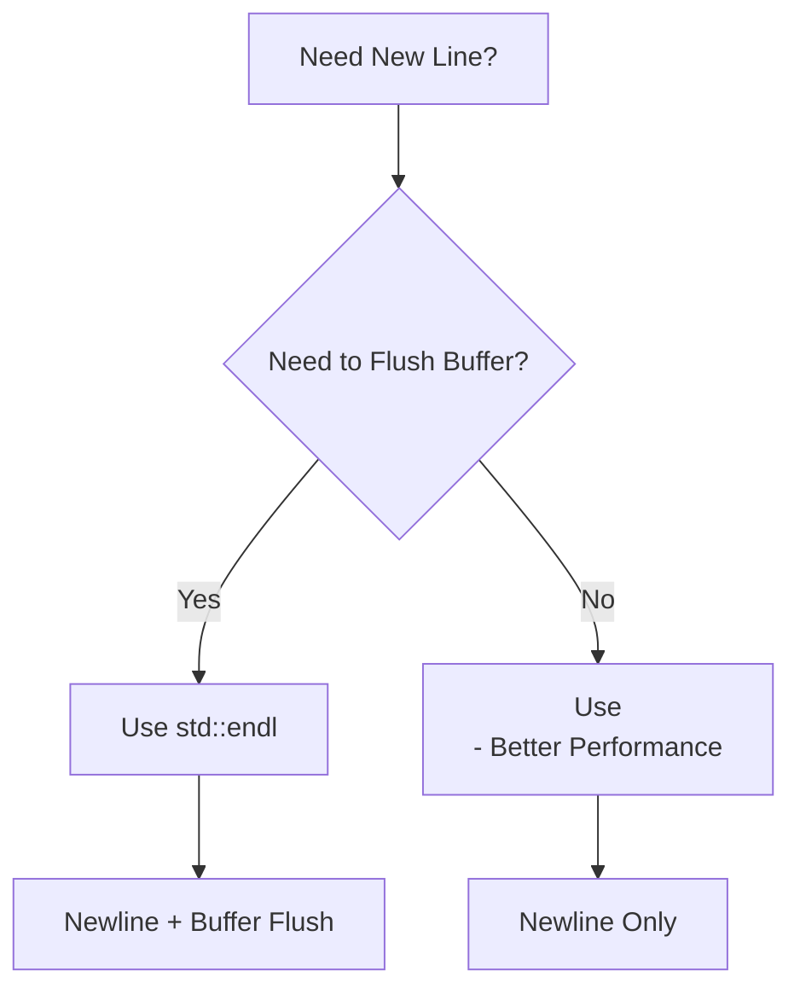

In C++, ``cout`` is an object of the iostream class that is used to display output to the standard output device, usually the monitor. It is associated with the standard C output stream ``stdout``. The insertion operator (<<) is used with `` cout `` to insert data into the output stream.

## Basic ``cout`` Syntax

The data needed to be displayed on the screen is inserted in the standard output stream ``cout`` using the insertion operator(<<).

```c++
#include <iostream>

int main() {
    std::cout << "Hello, World!";
    std::cout << "This is C++ output.";
    
    return 0;
}
```

| Component   | Description                    | Example                  |
|-------------|--------------------------------|--------------------------|
| Destination | `std::cout`                    | Standard output stream   |
| Operator    | `<<`                          | Insertion operator       |
| Data        | `"Message to be shown"`       | String, variable, etc.   |
| Termination | `;`                           | End of statement         |



## Creating New Lines

### Using `\n` (Recommended)

To output a newline without flushing the output buffer, we use `\n` (inside either single or double quotes), which is a special symbol that the compiler interprets as a newline character. `\n` moves the cursor to the next line of the console without causing a flush, so it will typically perform better.

```c++
#include <iostream>

int main() {
    std::cout << "First line\n";
    std::cout << "Second line\n";
    std::cout << "Third line";
    
    return 0;
}
```

### Using `std::endl`

endl inserts a new-line character and flushes the stream. Its behavior is equivalent to calling os.put('\n') (or os.put(os.widen('\n')) for character types other than char), and then os.flush().

```c++
#include <iostream>

int main() {
    std::cout << "First line" << std::endl;
    std::cout << "Second line" << std::endl;
    
    return 0;
}
```

## Key Differences: `\n` vs `std::endl`

std::cout << std::endl inserts a new line and flushes the stream(output buffer), whereas std::cout << "\n" just inserts a new line. Therefore, std::cout << std::endl; can be said equivalent to std::cout << '\n' << flush;

### Performance Consideration

To insert a line break into an output stream, just insert the newline character ('\n') instead of inserting std::endl. For example, write std::cout << "hello world" << '\n'; instead of writing std::cout << "hello world" << std::endl;

**Best Practice:** Use `\n` for better performance unless you specifically need to flush the output buffer.



## Multiple Output Operations

You can chain multiple insertions in a single statement:

```c++
#include <iostream>

int main() {
    int age = 25;
    std::string name = "Alice";
    
    std::cout << "Name: " << name << ", Age: " << age << "\n";
    
    return 0;
}
```

## Output Formatting (Advanced)

Use manipulators like std:: setw and std:: setfill to format the output.

```c++
#include <iostream>
#include <iomanip>

int main() {
    std::cout << std::setfill('*') << std::setw(10) << 77 << std::endl;
    return 0;
}
```

## Common Patterns

### Displaying Variables
```c++
int number = 42;
double price = 19.99;
char grade = 'A';

std::cout << "Number: " << number << "\n";
std::cout << "Price: $" << price << "\n";
std::cout << "Grade: " << grade << "\n";
```

### Multiple Lines
```c++
std::cout << "Line 1\n"
          << "Line 2\n"
          << "Line 3\n";
```

## Summary

- **cout** is an output stream object for console output
- **<<** is the insertion operator that sends data to the stream
- **\n** creates a new line (preferred for performance)
- **std::endl** creates a new line and flushes the buffer
- Always include `<iostream>` header and use `std::` namespace or `using namespace std;`
