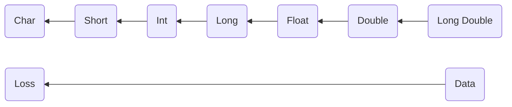

## Type Conversion Hierarchy



> **Important**: From **Long Double** to *Char* you are losing data (narrowing conversion).
> From *Char* to **Long Double** you don't lose data (widening conversion).

## Types of Type Conversion in C++

### 1. Implicit Conversion (Automatic)
The compiler automatically converts one data type to another when compatible.

```cpp
#include <iostream>
using namespace std;

int main() {
    int intVal = 42;
    double doubleVal = intVal;  // Implicit conversion: int → double (safe)
    
    double pi = 3.14159;
    int truncatedPi = pi;       // Implicit conversion: double → int (data loss!)
    
    cout << "Original: " << pi << ", Truncated: " << truncatedPi << endl;
    return 0;
}
```

### 2. Explicit Conversion (Manual Casting)

#### A. C-Style Casting (Discouraged)
```cpp
double num = 18.99;
int result = (int)num;          // C-style cast
int result2 = int(num);         // Function-style cast
```

#### B. Modern C++ Casting (Recommended)

## Modern C++ Cast Operators

### 1. `static_cast` - The Primary Cast
Favor static_cast when you need to convert a value from one type to another type. Static casting is used for compile-time type conversions and allows the compiler to check that the pointer and pointee data types are compatible.

```cpp
#include <iostream>
using namespace std;

int main() {
    // Numeric conversions
    double pi = 3.14159;
    int intPi = static_cast<int>(pi);           // Safe explicit conversion
    
    // Pointer conversions in inheritance
    class Base { virtual ~Base() = default; };
    class Derived : public Base {};
    
    Base* basePtr = new Derived();
    Derived* derivedPtr = static_cast<Derived*>(basePtr);  // Downcast
    
    cout << "Original: " << pi << ", Converted: " << intPi << endl;
    
    delete basePtr;
    return 0;
}
```

### 2. `dynamic_cast` - Runtime Type Checking  
Dynamic_cast has runtime overhead because it checks object types at run time using "Run-Time Type Information".

```cpp
#include <iostream>
#include <memory>
using namespace std;

class Base {
public:
    virtual ~Base() = default;
    virtual void show() { cout << "Base class" << endl; }
};

class Derived : public Base {
public:
    void show() override { cout << "Derived class" << endl; }
    void derivedSpecific() { cout << "Derived-specific method" << endl; }
};

int main() {
    unique_ptr<Base> basePtr = make_unique<Derived>();
    
    // Safe downcast with runtime checking
    if (auto derivedPtr = dynamic_cast<Derived*>(basePtr.get())) {
        derivedPtr->derivedSpecific();  // Success!
    } else {
        cout << "Cast failed - object is not of Derived type" << endl;
    }
    
    return 0;
}
```

### 3. `const_cast` - Modifying const/volatile
```cpp
#include <iostream>
using namespace std;

void modifyValue(int* ptr) {
    *ptr = 100;
}

int main() {
    const int value = 42;
    
    // Remove const qualifier (use with extreme caution!)
    int* mutablePtr = const_cast<int*>(&value);
    // modifyValue(mutablePtr);  // Undefined behavior if original was const!
    
    cout << "Value: " << value << endl;
    return 0;
}
```

### 4. `reinterpret_cast` - Low-level Reinterpretation
```cpp
#include <iostream>
using namespace std;

int main() {
    int number = 0x12345678;
    
    // Reinterpret bytes as different type (dangerous!)
    char* bytePtr = reinterpret_cast<char*>(&number);
    
    cout << "Number as bytes: ";
    for (size_t i = 0; i < sizeof(int); ++i) {
        cout << hex << (int)(unsigned char)bytePtr[i] << " ";
    }
    cout << endl;
    
    return 0;
}
```

## String Conversions with Error Handling

### Converting String to Numbers (Modern Approach)
For most modern applications, std::stoi is preferred due to its simplicity and exception-based error handling.

```cpp
#include <iostream>
#include <string>
#include <stdexcept>
using namespace std;

// Safe string to number conversion with error handling
template<typename T>
bool safeStringToNumber(const string& str, T& result) {
    try {
        if constexpr (is_same_v<T, int>) {
            result = stoi(str);
        } else if constexpr (is_same_v<T, float>) {
            result = stof(str);
        } else if constexpr (is_same_v<T, double>) {
            result = stod(str);
        } else if constexpr (is_same_v<T, long>) {
            result = stol(str);
        } else {
            return false;
        }
        return true;
    } catch (const invalid_argument& e) {
        cout << "Invalid argument: " << e.what() << endl;
        return false;
    } catch (const out_of_range& e) {
        cout << "Out of range: " << e.what() << endl;
        return false;
    }
}

int main() {
    string validStr = "123.456";
    string invalidStr = "abc123";
    string outOfRangeStr = "999999999999999999999";
    
    // Safe conversions with error checking
    int intResult;
    float floatResult;
    double doubleResult;
    
    cout << "=== Safe String Conversions ===" << endl;
    
    if (safeStringToNumber(validStr, intResult)) {
        cout << "String to int: " << intResult << endl;
    }
    
    if (safeStringToNumber(validStr, floatResult)) {
        cout << "String to float: " << floatResult << endl;
    }
    
    if (safeStringToNumber(validStr, doubleResult)) {
        cout << "String to double: " << doubleResult << endl;
    }
    
    // Test error handling
    cout << "\n=== Error Handling Tests ===" << endl;
    if (!safeStringToNumber(invalidStr, intResult)) {
        cout << "Failed to convert invalid string" << endl;
    }
    
    if (!safeStringToNumber(outOfRangeStr, intResult)) {
        cout << "Failed to convert out-of-range string" << endl;
    }
    
    return 0;
}
```

### Converting Numbers to String
```cpp
#include <iostream>
#include <string>
#include <sstream>
#include <iomanip>
using namespace std;

int main() {
    int intNum = 123;
    float floatNum = 346.356f;
    double doubleNum = 34376253648.123456;
    
    cout << "=== Number to String Conversions ===" << endl;
    
    // Method 1: std::to_string (simple but limited formatting)
    string str1 = to_string(intNum);
    string str2 = to_string(floatNum);
    string str3 = to_string(doubleNum);
    
    cout << "Using to_string():" << endl;
    cout << "Int: " << str1 << endl;
    cout << "Float: " << str2 << endl;
    cout << "Double: " << str3 << endl;
    
    // Method 2: stringstream (more control over formatting)
    ostringstream oss;
    oss << fixed << setprecision(2) << floatNum;
    string formattedFloat = oss.str();
    
    cout << "\nUsing stringstream with formatting:" << endl;
    cout << "Formatted float: " << formattedFloat << endl;
    
    return 0;
}
```

## Modern C++17+ Alternative: `std::from_chars`

With the introduction of C++17, the C++ Standard Library expanded its capabilities for converting text to numbers with the addition of std::from_chars. This low-level, high-performance API offers significant advantages over previous methods.

```cpp
#include <iostream>
#include <string>
#include <charconv>
using namespace std;

int main() {
    // C++17 std::from_chars - high performance, no exceptions
    string numberStr = "12345";
    int result;
    
    auto [ptr, ec] = from_chars(numberStr.data(), 
                               numberStr.data() + numberStr.size(), 
                               result);
    
    if (ec == errc{}) {
        cout << "Conversion successful: " << result << endl;
    } else {
        cout << "Conversion failed" << endl;
    }
    
    return 0;
}
```

## Best Practices Summary

### Casting Best Practices
1. **Prefer `static_cast`** for most explicit conversions
2. **Use `dynamic_cast`** for safe downcasting in inheritance hierarchies
3. **Avoid C-style casts** - they're unsafe and hide intent
4. **Use `const_cast` sparingly** and only when absolutely necessary
5. **Reserve `reinterpret_cast`** for low-level operations

### String Conversion Best Practices
1. **Always handle exceptions** when using `stoi`, `stof`, `stod`, etc.
2. **Use `std::from_chars`** for high-performance conversions (C++17+)
3. **Validate input** before conversion
4. **Consider locale settings** for international applications
5. **Use templates** for generic conversion functions

## Advanced Topics

### Custom Type Conversions
```cpp
class Temperature {
private:
    double celsius;
    
public:
    Temperature(double c) : celsius(c) {}
    
    // Explicit conversion operator
    explicit operator double() const { return celsius; }
    
    // Implicit conversion to Fahrenheit
    operator int() const { return static_cast<int>(celsius * 9.0/5.0 + 32); }
};

int main() {
    Temperature temp(25.0);
    
    double c = static_cast<double>(temp);  // Explicit conversion
    int f = temp;                          // Implicit conversion
    
    cout << "Celsius: " << c << ", Fahrenheit: " << f << endl;
    return 0;
}
```

This comprehensive guide covers all essential aspects of type conversion in modern C++, emphasizing safety, performance, and best practices for professional development.
