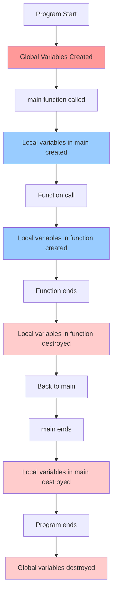
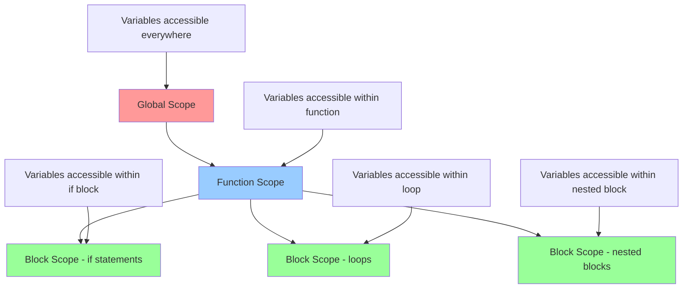

#### **Variable scope** 
determines where in your program a variable can be accessed and used. Think of scope as the "visibility zone" of a variable - it defines the boundaries within which a variable exists and can be referenced.

##  Types of Variable Scope

### 1. **Global Variables** 🌍
- **Definition**: Variables declared **outside** all functions
- **Accessibility**: Can be accessed from **anywhere** in the program
- **Lifetime**: Exists for the **entire duration** of program execution
- **Memory**: Stored in the global/static memory area

### 2. **Local Variables** 🏠
- **Definition**: Variables declared **inside** a function or block
- **Accessibility**: Can only be accessed **within that specific function/block**
- **Lifetime**: Created when function starts, destroyed when function ends
- **Memory**: Stored on the stack

## 📊 Visual Comparison



##  Practical Example

```cpp
#include <iostream>
#include <string>
using namespace std;

// 🌍 GLOBAL VARIABLE - accessible everywhere
int globalX = 500;

void myFunction()
{
    // 🏠 LOCAL VARIABLE - only accessible inside myFunction
    int localX = 300;
    
    cout << "Local X inside myFunction: " << localX << endl;
    cout << "Global X accessed from myFunction: " << globalX << endl;
}

int main()
{
    // 🏠 LOCAL VARIABLE - only accessible inside main
    int localX = 100;
    
    cout << "Local X inside main: " << localX << endl;
    
    // Call function - it has its own local scope
    myFunction();
    
    // Access global variable using scope resolution operator
    cout << "Global X accessed from main: " << ::globalX << endl;
    
    // Modify global variable
    ::globalX = 1000;
    cout << "Modified Global X: " << ::globalX << endl;
    
    return 0;
}
```

**Output:**
```
Local X inside main: 100
Local X inside myFunction: 300
Global X accessed from myFunction: 500
Global X accessed from main: 500
Modified Global X: 1000
```

## 📋 Detailed Comparison Table

| Feature | Global Variable | Local Variable |
|---------|----------------|----------------|
| **Declaration Location** | Outside all functions | Inside a function/block |
| **Access Scope** | Entire program | Only within declaring function/block |
| **Lifetime** | Program start to end | Function/block start to end |
| **Memory Location** | Global/Static memory | Stack memory |
| **Initialization** | Automatically initialized to 0 (for numeric types) | Contains garbage value if not initialized |
| **Access Method** | Direct name or `::variableName` | Direct name only |
| **Performance** | Slightly slower access | Faster access |
| **Memory Usage** | Exists throughout program (may waste memory) | Created/destroyed as needed (efficient) |

## ⚠️ Variable Shadowing

Variable shadowing occurs when a local variable has the same name as a global variable. The local variable "shadows" or hides the global variable within its scope.

```cpp
#include <iostream>
using namespace std;

int x = 50; // Global variable

int main() {
    int x = 100; // Local variable shadows the global one
    
    cout << "Local x: " << x << endl;        // Prints: 100
    cout << "Global x: " << ::x << endl;     // Prints: 50
    
    return 0;
}
```

##  Scope Resolution Operator (::)

The `::` operator allows you to access global variables even when they're shadowed by local variables:

```cpp
int value = 200; // Global

int main() {
    int value = 300; // Local (shadows global)
    
    cout << value << endl;    // Prints: 300 (local)
    cout << ::value << endl;  // Prints: 200 (global)
    
    ::value = 400;           // Modify global variable
    cout << ::value << endl; // Prints: 400
    
    return 0;
}
```

##  Scope Hierarchy



## ✅ Best Practices

### DO:
- **Use meaningful names** to avoid confusion
- **Minimize global variables** - use them sparingly
- **Initialize variables** when declaring them
- **Use local variables** whenever possible for better encapsulation
- **Use const for global constants** that won't change

### DON'T:
- **Avoid variable shadowing** - don't use the same name for global and local variables
- **Don't rely heavily on global variables** - they make code harder to debug and maintain
- **Don't modify global variables from multiple functions** without careful consideration

## Advanced Example: Different Scope Levels

```cpp
#include <iostream>
using namespace std;

int globalVar = 10; // Global scope

void demonstrateScopes() {
    int functionVar = 20; // Function scope
    
    cout << "Global: " << globalVar << endl;
    cout << "Function: " << functionVar << endl;
    
    // Block scope example
    if (true) {
        int blockVar = 30; // Block scope
        cout << "Block: " << blockVar << endl;
        cout << "Function from block: " << functionVar << endl;
        cout << "Global from block: " << globalVar << endl;
    }
    
    // blockVar is not accessible here - would cause compilation error
    // cout << blockVar; // ERROR!
}

int main() {
    demonstrateScopes();
    
    // Only globalVar is accessible here
    cout << "Global from main: " << globalVar << endl;
    
    // functionVar and blockVar are not accessible here
    return 0;
}
```

## 📝 Key Takeaways

1. **Global variables** are accessible throughout the entire program but should be used judiciously
2. **Local variables** are confined to their declaring function/block and are generally preferred
3. **Variable shadowing** can lead to confusion and should be avoided
4. **Scope resolution operator (::)** helps access global variables when shadowed
5. **Good naming conventions** and minimal global variable usage lead to cleaner, more maintainable code


